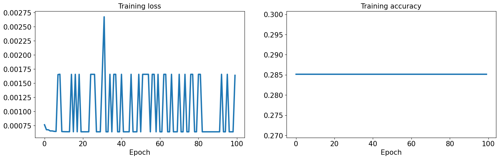

# Air Compressor predictive maintenance using Machine Learning

Notebook link: https://colab.research.google.com/drive/1Q2n_c4ODnUbItGiBd712_5gjqitWOSpN#scrollTo=NfpkY_QoQQK-

We explore the use of machine learning to predict and maintain the performance of air compressor systems. Air compressors are essential devices that convert power into potential energy stored in compressed air, which can then be utilized for various applications such as powering pneumatic tools, inflating tires, and operating machinery. Ensuring air compressors’ optimal performance and longevity is crucial for many industries, and predictive maintenance can help identify potential failures and improve the maintenance process.

## Application type

We will predict the bearings status in the air compressor system, a binary variable (0 or 1). Therefore, this is a classification project.

The goal here is to model the bearings’ status based on the features of the air compressor system for its subsequent use in predictive maintenance.


```python
import numpy as np
import pandas as pd
import matplotlib.pyplot as plt
import torch
import sklearn
```

## Dataset

The data file air_compressor_maintenance.csv contains the information for the air compressor example. This dataset consists of measurements taken from a compressor system supplying air to a factory production line, with 17 features collected in total. The dataset comprises 17 variables (columns) and 1000 instances (rows).

The features or variables included in the dataset are as follows:


* **RPM:** Indicates the number of rotations per minute for the motor.

* **Motor Power:** Measures the power consumption of the electric motor in kilowatts.

* **Torque:** Provides the torque produced by the motor in Newton-meter.

* **Outlet Pressure Bar:** Denotes the outlet pressure of compressed air in bars.

* **Air Flow:** Displays the flow rate of compressed air in cubic meters per minute.

* **Noise dB:** Represents the noise level of the compressor system in decibels.

* **Outlet Temp:** Shows the outlet temperature of the compressed air in degrees Celsius.

* **Water Pump Outlet Pressure:** Gives the outlet pressure of the water pump in bars.

* **Water Inlet Temp:** Specifies the inlet temperature of cooling water in degrees Celsius.

* **Water Outlet Temp:** Provides the outlet temperature of cooling water in degrees Celsius.

* **Water Pump Power:** Measures the power consumption of the water pump in kilowatts.

* **Water Flow:** Indicates the cooling water flow rate in cubic meters per minute.

* **Oil Pump Power:** This represents the power consumption of the oil pump in kilowatts.

* **Oil Tank Temp:** Shows the temperature of the oil tank in degrees Celsius.

* **Ground Acceleration:** Represents the acceleration experienced by the compressor at its mounting point, measured in the X, Y, and Z directions in meters per second squared.

* **Head Acceleration:** Refers to the acceleration value measured at the compressor head bolt or upper cooling fin in the X, Y, and Z directions, typically expressed in gravitational units.

* **Bearings Status:** Indicates the condition of the bearings in the motor and compressor system. The values can be ‘Ok’(value 0) for properly functioning bearings or ‘Noise’(value 1) for bearings that may need maintenance or replacement due to wear or damage affecting the performance and efficiency of the compressor.


```python
df = pd.read_csv('https://raw.githubusercontent.com/Prafful-Vyas/Air-Compressor-predictive-maintenance-using-ML/main/aircompressor.csv')
```

### Data preparation


```python
df.head()
```


  <div id="df-cab05bbc-f856-4873-978d-690b4355c1cc" class="colab-df-container">
    <div>
<style scoped>
    .dataframe tbody tr th:only-of-type {
        vertical-align: middle;
    }

    .dataframe tbody tr th {
        vertical-align: top;
    }

    .dataframe thead th {
        text-align: right;
    }
</style>
<table border="1" class="dataframe">
  <thead>
    <tr style="text-align: right;">
      <th></th>
      <th>id</th>
      <th>rpm</th>
      <th>motor_power</th>
      <th>torque</th>
      <th>outlet_pressure_bar</th>
      <th>air_flow</th>
      <th>noise_db</th>
      <th>outlet_temp</th>
      <th>wpump_outlet_press</th>
      <th>water_inlet_temp</th>
      <th>...</th>
      <th>gaccy</th>
      <th>gaccz</th>
      <th>haccx</th>
      <th>haccy</th>
      <th>haccz</th>
      <th>bearings</th>
      <th>wpump</th>
      <th>radiator</th>
      <th>exvalve</th>
      <th>acmotor</th>
    </tr>
  </thead>
  <tbody>
    <tr>
      <th>0</th>
      <td>1</td>
      <td>499</td>
      <td>1405.842858</td>
      <td>27.511708</td>
      <td>1.000</td>
      <td>308.289879</td>
      <td>40.840517</td>
      <td>78.554715</td>
      <td>2.960632</td>
      <td>43.166392</td>
      <td>...</td>
      <td>0.383773</td>
      <td>2.649801</td>
      <td>1.213344</td>
      <td>1.409218</td>
      <td>2.962484</td>
      <td>0</td>
      <td>0</td>
      <td>0</td>
      <td>0</td>
      <td>Stable</td>
    </tr>
    <tr>
      <th>1</th>
      <td>2</td>
      <td>513</td>
      <td>1457.370092</td>
      <td>31.030115</td>
      <td>1.081</td>
      <td>307.833736</td>
      <td>40.484226</td>
      <td>76.902822</td>
      <td>2.536711</td>
      <td>47.342143</td>
      <td>...</td>
      <td>0.450954</td>
      <td>2.669423</td>
      <td>1.210674</td>
      <td>1.379050</td>
      <td>2.938135</td>
      <td>0</td>
      <td>0</td>
      <td>0</td>
      <td>0</td>
      <td>Stable</td>
    </tr>
    <tr>
      <th>2</th>
      <td>3</td>
      <td>495</td>
      <td>1582.249959</td>
      <td>33.484653</td>
      <td>1.369</td>
      <td>307.377593</td>
      <td>40.918572</td>
      <td>77.547021</td>
      <td>2.112789</td>
      <td>49.306593</td>
      <td>...</td>
      <td>0.443924</td>
      <td>2.772009</td>
      <td>1.210612</td>
      <td>1.373490</td>
      <td>2.991878</td>
      <td>0</td>
      <td>0</td>
      <td>0</td>
      <td>0</td>
      <td>Stable</td>
    </tr>
    <tr>
      <th>3</th>
      <td>4</td>
      <td>480</td>
      <td>1712.466820</td>
      <td>36.394475</td>
      <td>1.691</td>
      <td>306.975248</td>
      <td>40.450953</td>
      <td>80.059949</td>
      <td>2.087534</td>
      <td>46.886933</td>
      <td>...</td>
      <td>0.370457</td>
      <td>2.876056</td>
      <td>1.213223</td>
      <td>1.443234</td>
      <td>3.096158</td>
      <td>0</td>
      <td>0</td>
      <td>0</td>
      <td>0</td>
      <td>Stable</td>
    </tr>
    <tr>
      <th>4</th>
      <td>5</td>
      <td>498</td>
      <td>1766.035170</td>
      <td>38.249154</td>
      <td>1.731</td>
      <td>306.832132</td>
      <td>41.233739</td>
      <td>79.130424</td>
      <td>2.338877</td>
      <td>50.498100</td>
      <td>...</td>
      <td>0.383868</td>
      <td>2.849451</td>
      <td>1.209216</td>
      <td>1.405190</td>
      <td>3.059417</td>
      <td>0</td>
      <td>0</td>
      <td>0</td>
      <td>0</td>
      <td>Stable</td>
    </tr>
  </tbody>
</table>
<p>5 rows × 26 columns</p>
</div>
    <div class="colab-df-buttons">

  <div class="colab-df-container">
    <button class="colab-df-convert" onclick="convertToInteractive('df-cab05bbc-f856-4873-978d-690b4355c1cc')"
            title="Convert this dataframe to an interactive table."
            style="display:none;">

  <svg xmlns="http://www.w3.org/2000/svg" height="24px" viewBox="0 -960 960 960">
    <path d="M120-120v-720h720v720H120Zm60-500h600v-160H180v160Zm220 220h160v-160H400v160Zm0 220h160v-160H400v160ZM180-400h160v-160H180v160Zm440 0h160v-160H620v160ZM180-180h160v-160H180v160Zm440 0h160v-160H620v160Z"/>
  </svg>
    </button>

  <style>
    .colab-df-container {
      display:flex;
      gap: 12px;
    }

    .colab-df-convert {
      background-color: #E8F0FE;
      border: none;
      border-radius: 50%;
      cursor: pointer;
      display: none;
      fill: #1967D2;
      height: 32px;
      padding: 0 0 0 0;
      width: 32px;
    }

    .colab-df-convert:hover {
      background-color: #E2EBFA;
      box-shadow: 0px 1px 2px rgba(60, 64, 67, 0.3), 0px 1px 3px 1px rgba(60, 64, 67, 0.15);
      fill: #174EA6;
    }

    .colab-df-buttons div {
      margin-bottom: 4px;
    }

    [theme=dark] .colab-df-convert {
      background-color: #3B4455;
      fill: #D2E3FC;
    }

    [theme=dark] .colab-df-convert:hover {
      background-color: #434B5C;
      box-shadow: 0px 1px 3px 1px rgba(0, 0, 0, 0.15);
      filter: drop-shadow(0px 1px 2px rgba(0, 0, 0, 0.3));
      fill: #FFFFFF;
    }
  </style>

    <script>
      const buttonEl =
        document.querySelector('#df-cab05bbc-f856-4873-978d-690b4355c1cc button.colab-df-convert');
      buttonEl.style.display =
        google.colab.kernel.accessAllowed ? 'block' : 'none';

      async function convertToInteractive(key) {
        const element = document.querySelector('#df-cab05bbc-f856-4873-978d-690b4355c1cc');
        const dataTable =
          await google.colab.kernel.invokeFunction('convertToInteractive',
                                                    [key], {});
        if (!dataTable) return;

        const docLinkHtml = 'Like what you see? Visit the ' +
          '<a target="_blank" href=https://colab.research.google.com/notebooks/data_table.ipynb>data table notebook</a>'
          + ' to learn more about interactive tables.';
        element.innerHTML = '';
        dataTable['output_type'] = 'display_data';
        await google.colab.output.renderOutput(dataTable, element);
        const docLink = document.createElement('div');
        docLink.innerHTML = docLinkHtml;
        element.appendChild(docLink);
      }
    </script>
  </div>


<div id="df-77a3443a-1e7b-496a-bbac-c911adca5e75">
  <button class="colab-df-quickchart" onclick="quickchart('df-77a3443a-1e7b-496a-bbac-c911adca5e75')"
            title="Suggest charts"
            style="display:none;">

<svg xmlns="http://www.w3.org/2000/svg" height="24px"viewBox="0 0 24 24"
     width="24px">
    <g>
        <path d="M19 3H5c-1.1 0-2 .9-2 2v14c0 1.1.9 2 2 2h14c1.1 0 2-.9 2-2V5c0-1.1-.9-2-2-2zM9 17H7v-7h2v7zm4 0h-2V7h2v10zm4 0h-2v-4h2v4z"/>
    </g>
</svg>
  </button>

<style>
  .colab-df-quickchart {
      --bg-color: #E8F0FE;
      --fill-color: #1967D2;
      --hover-bg-color: #E2EBFA;
      --hover-fill-color: #174EA6;
      --disabled-fill-color: #AAA;
      --disabled-bg-color: #DDD;
  }

  [theme=dark] .colab-df-quickchart {
      --bg-color: #3B4455;
      --fill-color: #D2E3FC;
      --hover-bg-color: #434B5C;
      --hover-fill-color: #FFFFFF;
      --disabled-bg-color: #3B4455;
      --disabled-fill-color: #666;
  }

  .colab-df-quickchart {
    background-color: var(--bg-color);
    border: none;
    border-radius: 50%;
    cursor: pointer;
    display: none;
    fill: var(--fill-color);
    height: 32px;
    padding: 0;
    width: 32px;
  }

  .colab-df-quickchart:hover {
    background-color: var(--hover-bg-color);
    box-shadow: 0 1px 2px rgba(60, 64, 67, 0.3), 0 1px 3px 1px rgba(60, 64, 67, 0.15);
    fill: var(--button-hover-fill-color);
  }

  .colab-df-quickchart-complete:disabled,
  .colab-df-quickchart-complete:disabled:hover {
    background-color: var(--disabled-bg-color);
    fill: var(--disabled-fill-color);
    box-shadow: none;
  }

  .colab-df-spinner {
    border: 2px solid var(--fill-color);
    border-color: transparent;
    border-bottom-color: var(--fill-color);
    animation:
      spin 1s steps(1) infinite;
  }

  @keyframes spin {
    0% {
      border-color: transparent;
      border-bottom-color: var(--fill-color);
      border-left-color: var(--fill-color);
    }
    20% {
      border-color: transparent;
      border-left-color: var(--fill-color);
      border-top-color: var(--fill-color);
    }
    30% {
      border-color: transparent;
      border-left-color: var(--fill-color);
      border-top-color: var(--fill-color);
      border-right-color: var(--fill-color);
    }
    40% {
      border-color: transparent;
      border-right-color: var(--fill-color);
      border-top-color: var(--fill-color);
    }
    60% {
      border-color: transparent;
      border-right-color: var(--fill-color);
    }
    80% {
      border-color: transparent;
      border-right-color: var(--fill-color);
      border-bottom-color: var(--fill-color);
    }
    90% {
      border-color: transparent;
      border-bottom-color: var(--fill-color);
    }
  }
</style>

  <script>
    async function quickchart(key) {
      const quickchartButtonEl =
        document.querySelector('#' + key + ' button');
      quickchartButtonEl.disabled = true;  // To prevent multiple clicks.
      quickchartButtonEl.classList.add('colab-df-spinner');
      try {
        const charts = await google.colab.kernel.invokeFunction(
            'suggestCharts', [key], {});
      } catch (error) {
        console.error('Error during call to suggestCharts:', error);
      }
      quickchartButtonEl.classList.remove('colab-df-spinner');
      quickchartButtonEl.classList.add('colab-df-quickchart-complete');
    }
    (() => {
      let quickchartButtonEl =
        document.querySelector('#df-77a3443a-1e7b-496a-bbac-c911adca5e75 button');
      quickchartButtonEl.style.display =
        google.colab.kernel.accessAllowed ? 'block' : 'none';
    })();
  </script>
</div>

    </div>
  </div>


```python
# List of columns to be dropped
columns_to_drop = ['id','wpump', 'radiator', 'exvalve','acmotor']

# Drop the columns
df.drop(columns_to_drop, axis=1, inplace=True)

```


```python
# identify missing values
df.isnull().sum()
```


<div>
<style scoped>
    .dataframe tbody tr th:only-of-type {
        vertical-align: middle;
    }

    .dataframe tbody tr th {
        vertical-align: top;
    }

    .dataframe thead th {
        text-align: right;
    }
</style>
<table border="1" class="dataframe">
  <thead>
    <tr style="text-align: right;">
      <th></th>
      <th>0</th>
    </tr>
  </thead>
  <tbody>
    <tr>
      <th>rpm</th>
      <td>0</td>
    </tr>
    <tr>
      <th>motor_power</th>
      <td>0</td>
    </tr>
    <tr>
      <th>torque</th>
      <td>0</td>
    </tr>
    <tr>
      <th>outlet_pressure_bar</th>
      <td>0</td>
    </tr>
    <tr>
      <th>air_flow</th>
      <td>0</td>
    </tr>
    <tr>
      <th>noise_db</th>
      <td>0</td>
    </tr>
    <tr>
      <th>outlet_temp</th>
      <td>0</td>
    </tr>
    <tr>
      <th>wpump_outlet_press</th>
      <td>0</td>
    </tr>
    <tr>
      <th>water_inlet_temp</th>
      <td>0</td>
    </tr>
    <tr>
      <th>water_outlet_temp</th>
      <td>0</td>
    </tr>
    <tr>
      <th>wpump_power</th>
      <td>0</td>
    </tr>
    <tr>
      <th>water_flow</th>
      <td>0</td>
    </tr>
    <tr>
      <th>oilpump_power</th>
      <td>0</td>
    </tr>
    <tr>
      <th>oil_tank_temp</th>
      <td>0</td>
    </tr>
    <tr>
      <th>gaccx</th>
      <td>0</td>
    </tr>
    <tr>
      <th>gaccy</th>
      <td>0</td>
    </tr>
    <tr>
      <th>gaccz</th>
      <td>0</td>
    </tr>
    <tr>
      <th>haccx</th>
      <td>0</td>
    </tr>
    <tr>
      <th>haccy</th>
      <td>0</td>
    </tr>
    <tr>
      <th>haccz</th>
      <td>0</td>
    </tr>
    <tr>
      <th>bearings</th>
      <td>0</td>
    </tr>
  </tbody>
</table>
</div><br><label><b>dtype:</b> int64</label>


```python
# Adding timestamp of frequency = 1 minute to the dataset

import datetime

# Generate a time series with one-minute intervals
time_series = pd.date_range(start='00:00:00', end='16:39:00', freq='1min')

# Create a new DataFrame with timestamps
df['timestamp'] = time_series
df['timestamp'] = df['timestamp'].dt.time


# show the updated DataFrame
df.head()
```


  <div id="df-5aa7de26-43ad-4fc9-8398-f0499ea47e1c" class="colab-df-container">
    <div>
<style scoped>
    .dataframe tbody tr th:only-of-type {
        vertical-align: middle;
    }

    .dataframe tbody tr th {
        vertical-align: top;
    }

    .dataframe thead th {
        text-align: right;
    }
</style>
<table border="1" class="dataframe">
  <thead>
    <tr style="text-align: right;">
      <th></th>
      <th>rpm</th>
      <th>motor_power</th>
      <th>torque</th>
      <th>outlet_pressure_bar</th>
      <th>air_flow</th>
      <th>noise_db</th>
      <th>outlet_temp</th>
      <th>wpump_outlet_press</th>
      <th>water_inlet_temp</th>
      <th>water_outlet_temp</th>
      <th>...</th>
      <th>oilpump_power</th>
      <th>oil_tank_temp</th>
      <th>gaccx</th>
      <th>gaccy</th>
      <th>gaccz</th>
      <th>haccx</th>
      <th>haccy</th>
      <th>haccz</th>
      <th>bearings</th>
      <th>timestamp</th>
    </tr>
  </thead>
  <tbody>
    <tr>
      <th>0</th>
      <td>499</td>
      <td>1405.842858</td>
      <td>27.511708</td>
      <td>1.000</td>
      <td>308.289879</td>
      <td>40.840517</td>
      <td>78.554715</td>
      <td>2.960632</td>
      <td>43.166392</td>
      <td>47.259238</td>
      <td>...</td>
      <td>300.372921</td>
      <td>45.806178</td>
      <td>0.711820</td>
      <td>0.383773</td>
      <td>2.649801</td>
      <td>1.213344</td>
      <td>1.409218</td>
      <td>2.962484</td>
      <td>0</td>
      <td>00:00:00</td>
    </tr>
    <tr>
      <th>1</th>
      <td>513</td>
      <td>1457.370092</td>
      <td>31.030115</td>
      <td>1.081</td>
      <td>307.833736</td>
      <td>40.484226</td>
      <td>76.902822</td>
      <td>2.536711</td>
      <td>47.342143</td>
      <td>55.025653</td>
      <td>...</td>
      <td>301.391605</td>
      <td>45.825384</td>
      <td>0.704667</td>
      <td>0.450954</td>
      <td>2.669423</td>
      <td>1.210674</td>
      <td>1.379050</td>
      <td>2.938135</td>
      <td>0</td>
      <td>00:01:00</td>
    </tr>
    <tr>
      <th>2</th>
      <td>495</td>
      <td>1582.249959</td>
      <td>33.484653</td>
      <td>1.369</td>
      <td>307.377593</td>
      <td>40.918572</td>
      <td>77.547021</td>
      <td>2.112789</td>
      <td>49.306593</td>
      <td>50.505622</td>
      <td>...</td>
      <td>300.973376</td>
      <td>45.844730</td>
      <td>0.704828</td>
      <td>0.443924</td>
      <td>2.772009</td>
      <td>1.210612</td>
      <td>1.373490</td>
      <td>2.991878</td>
      <td>0</td>
      <td>00:02:00</td>
    </tr>
    <tr>
      <th>3</th>
      <td>480</td>
      <td>1712.466820</td>
      <td>36.394475</td>
      <td>1.691</td>
      <td>306.975248</td>
      <td>40.450953</td>
      <td>80.059949</td>
      <td>2.087534</td>
      <td>46.886933</td>
      <td>58.706376</td>
      <td>...</td>
      <td>300.355630</td>
      <td>45.817046</td>
      <td>0.726604</td>
      <td>0.370457</td>
      <td>2.876056</td>
      <td>1.213223</td>
      <td>1.443234</td>
      <td>3.096158</td>
      <td>0</td>
      <td>00:03:00</td>
    </tr>
    <tr>
      <th>4</th>
      <td>498</td>
      <td>1766.035170</td>
      <td>38.249154</td>
      <td>1.731</td>
      <td>306.832132</td>
      <td>41.233739</td>
      <td>79.130424</td>
      <td>2.338877</td>
      <td>50.498100</td>
      <td>54.046362</td>
      <td>...</td>
      <td>300.440568</td>
      <td>45.817640</td>
      <td>0.707785</td>
      <td>0.383868</td>
      <td>2.849451</td>
      <td>1.209216</td>
      <td>1.405190</td>
      <td>3.059417</td>
      <td>0</td>
      <td>00:04:00</td>
    </tr>
  </tbody>
</table>
<p>5 rows × 22 columns</p>
</div>
    <div class="colab-df-buttons">

  <div class="colab-df-container">
    <button class="colab-df-convert" onclick="convertToInteractive('df-5aa7de26-43ad-4fc9-8398-f0499ea47e1c')"
            title="Convert this dataframe to an interactive table."
            style="display:none;">

  <svg xmlns="http://www.w3.org/2000/svg" height="24px" viewBox="0 -960 960 960">
    <path d="M120-120v-720h720v720H120Zm60-500h600v-160H180v160Zm220 220h160v-160H400v160Zm0 220h160v-160H400v160ZM180-400h160v-160H180v160Zm440 0h160v-160H620v160ZM180-180h160v-160H180v160Zm440 0h160v-160H620v160Z"/>
  </svg>
    </button>

  <style>
    .colab-df-container {
      display:flex;
      gap: 12px;
    }

    .colab-df-convert {
      background-color: #E8F0FE;
      border: none;
      border-radius: 50%;
      cursor: pointer;
      display: none;
      fill: #1967D2;
      height: 32px;
      padding: 0 0 0 0;
      width: 32px;
    }

    .colab-df-convert:hover {
      background-color: #E2EBFA;
      box-shadow: 0px 1px 2px rgba(60, 64, 67, 0.3), 0px 1px 3px 1px rgba(60, 64, 67, 0.15);
      fill: #174EA6;
    }

    .colab-df-buttons div {
      margin-bottom: 4px;
    }

    [theme=dark] .colab-df-convert {
      background-color: #3B4455;
      fill: #D2E3FC;
    }

    [theme=dark] .colab-df-convert:hover {
      background-color: #434B5C;
      box-shadow: 0px 1px 3px 1px rgba(0, 0, 0, 0.15);
      filter: drop-shadow(0px 1px 2px rgba(0, 0, 0, 0.3));
      fill: #FFFFFF;
    }
  </style>

    <script>
      const buttonEl =
        document.querySelector('#df-5aa7de26-43ad-4fc9-8398-f0499ea47e1c button.colab-df-convert');
      buttonEl.style.display =
        google.colab.kernel.accessAllowed ? 'block' : 'none';

      async function convertToInteractive(key) {
        const element = document.querySelector('#df-5aa7de26-43ad-4fc9-8398-f0499ea47e1c');
        const dataTable =
          await google.colab.kernel.invokeFunction('convertToInteractive',
                                                    [key], {});
        if (!dataTable) return;

        const docLinkHtml = 'Like what you see? Visit the ' +
          '<a target="_blank" href=https://colab.research.google.com/notebooks/data_table.ipynb>data table notebook</a>'
          + ' to learn more about interactive tables.';
        element.innerHTML = '';
        dataTable['output_type'] = 'display_data';
        await google.colab.output.renderOutput(dataTable, element);
        const docLink = document.createElement('div');
        docLink.innerHTML = docLinkHtml;
        element.appendChild(docLink);
      }
    </script>
  </div>


<div id="df-8a9b63f9-0ac3-4d49-af87-c7aea3924f67">
  <button class="colab-df-quickchart" onclick="quickchart('df-8a9b63f9-0ac3-4d49-af87-c7aea3924f67')"
            title="Suggest charts"
            style="display:none;">

<svg xmlns="http://www.w3.org/2000/svg" height="24px"viewBox="0 0 24 24"
     width="24px">
    <g>
        <path d="M19 3H5c-1.1 0-2 .9-2 2v14c0 1.1.9 2 2 2h14c1.1 0 2-.9 2-2V5c0-1.1-.9-2-2-2zM9 17H7v-7h2v7zm4 0h-2V7h2v10zm4 0h-2v-4h2v4z"/>
    </g>
</svg>
  </button>

<style>
  .colab-df-quickchart {
      --bg-color: #E8F0FE;
      --fill-color: #1967D2;
      --hover-bg-color: #E2EBFA;
      --hover-fill-color: #174EA6;
      --disabled-fill-color: #AAA;
      --disabled-bg-color: #DDD;
  }

  [theme=dark] .colab-df-quickchart {
      --bg-color: #3B4455;
      --fill-color: #D2E3FC;
      --hover-bg-color: #434B5C;
      --hover-fill-color: #FFFFFF;
      --disabled-bg-color: #3B4455;
      --disabled-fill-color: #666;
  }

  .colab-df-quickchart {
    background-color: var(--bg-color);
    border: none;
    border-radius: 50%;
    cursor: pointer;
    display: none;
    fill: var(--fill-color);
    height: 32px;
    padding: 0;
    width: 32px;
  }

  .colab-df-quickchart:hover {
    background-color: var(--hover-bg-color);
    box-shadow: 0 1px 2px rgba(60, 64, 67, 0.3), 0 1px 3px 1px rgba(60, 64, 67, 0.15);
    fill: var(--button-hover-fill-color);
  }

  .colab-df-quickchart-complete:disabled,
  .colab-df-quickchart-complete:disabled:hover {
    background-color: var(--disabled-bg-color);
    fill: var(--disabled-fill-color);
    box-shadow: none;
  }

  .colab-df-spinner {
    border: 2px solid var(--fill-color);
    border-color: transparent;
    border-bottom-color: var(--fill-color);
    animation:
      spin 1s steps(1) infinite;
  }

  @keyframes spin {
    0% {
      border-color: transparent;
      border-bottom-color: var(--fill-color);
      border-left-color: var(--fill-color);
    }
    20% {
      border-color: transparent;
      border-left-color: var(--fill-color);
      border-top-color: var(--fill-color);
    }
    30% {
      border-color: transparent;
      border-left-color: var(--fill-color);
      border-top-color: var(--fill-color);
      border-right-color: var(--fill-color);
    }
    40% {
      border-color: transparent;
      border-right-color: var(--fill-color);
      border-top-color: var(--fill-color);
    }
    60% {
      border-color: transparent;
      border-right-color: var(--fill-color);
    }
    80% {
      border-color: transparent;
      border-right-color: var(--fill-color);
      border-bottom-color: var(--fill-color);
    }
    90% {
      border-color: transparent;
      border-bottom-color: var(--fill-color);
    }
  }
</style>

  <script>
    async function quickchart(key) {
      const quickchartButtonEl =
        document.querySelector('#' + key + ' button');
      quickchartButtonEl.disabled = true;  // To prevent multiple clicks.
      quickchartButtonEl.classList.add('colab-df-spinner');
      try {
        const charts = await google.colab.kernel.invokeFunction(
            'suggestCharts', [key], {});
      } catch (error) {
        console.error('Error during call to suggestCharts:', error);
      }
      quickchartButtonEl.classList.remove('colab-df-spinner');
      quickchartButtonEl.classList.add('colab-df-quickchart-complete');
    }
    (() => {
      let quickchartButtonEl =
        document.querySelector('#df-8a9b63f9-0ac3-4d49-af87-c7aea3924f67 button');
      quickchartButtonEl.style.display =
        google.colab.kernel.accessAllowed ? 'block' : 'none';
    })();
  </script>
</div>

    </div>
  </div>


```python
# checking for no. of unique values in bearings
df.groupby(df['bearings']).size()
```


<div>
<style scoped>
    .dataframe tbody tr th:only-of-type {
        vertical-align: middle;
    }

    .dataframe tbody tr th {
        vertical-align: top;
    }

    .dataframe thead th {
        text-align: right;
    }
</style>
<table border="1" class="dataframe">
  <thead>
    <tr style="text-align: right;">
      <th></th>
      <th>0</th>
    </tr>
    <tr>
      <th>bearings</th>
      <th></th>
    </tr>
  </thead>
  <tbody>
    <tr>
      <th>0</th>
      <td>800</td>
    </tr>
    <tr>
      <th>1</th>
      <td>200</td>
    </tr>
  </tbody>
</table>
</div><br><label><b>dtype:</b> int64</label>


```python
df.dtypes
```


<div>
<style scoped>
    .dataframe tbody tr th:only-of-type {
        vertical-align: middle;
    }

    .dataframe tbody tr th {
        vertical-align: top;
    }

    .dataframe thead th {
        text-align: right;
    }
</style>
<table border="1" class="dataframe">
  <thead>
    <tr style="text-align: right;">
      <th></th>
      <th>0</th>
    </tr>
  </thead>
  <tbody>
    <tr>
      <th>rpm</th>
      <td>int64</td>
    </tr>
    <tr>
      <th>motor_power</th>
      <td>float64</td>
    </tr>
    <tr>
      <th>torque</th>
      <td>float64</td>
    </tr>
    <tr>
      <th>outlet_pressure_bar</th>
      <td>float64</td>
    </tr>
    <tr>
      <th>air_flow</th>
      <td>float64</td>
    </tr>
    <tr>
      <th>noise_db</th>
      <td>float64</td>
    </tr>
    <tr>
      <th>outlet_temp</th>
      <td>float64</td>
    </tr>
    <tr>
      <th>wpump_outlet_press</th>
      <td>float64</td>
    </tr>
    <tr>
      <th>water_inlet_temp</th>
      <td>float64</td>
    </tr>
    <tr>
      <th>water_outlet_temp</th>
      <td>float64</td>
    </tr>
    <tr>
      <th>wpump_power</th>
      <td>float64</td>
    </tr>
    <tr>
      <th>water_flow</th>
      <td>float64</td>
    </tr>
    <tr>
      <th>oilpump_power</th>
      <td>float64</td>
    </tr>
    <tr>
      <th>oil_tank_temp</th>
      <td>float64</td>
    </tr>
    <tr>
      <th>gaccx</th>
      <td>float64</td>
    </tr>
    <tr>
      <th>gaccy</th>
      <td>float64</td>
    </tr>
    <tr>
      <th>gaccz</th>
      <td>float64</td>
    </tr>
    <tr>
      <th>haccx</th>
      <td>float64</td>
    </tr>
    <tr>
      <th>haccy</th>
      <td>float64</td>
    </tr>
    <tr>
      <th>haccz</th>
      <td>float64</td>
    </tr>
    <tr>
      <th>bearings</th>
      <td>int64</td>
    </tr>
    <tr>
      <th>timestamp</th>
      <td>object</td>
    </tr>
  </tbody>
</table>
</div><br><label><b>dtype:</b> object</label>


```python
def time_to_minutes(time_obj):
    return (time_obj.hour * 60) + time_obj.minute

df['time_minutes'] = df['timestamp'].apply(time_to_minutes).astype(float)
```


```python
df.head()
```


  <div id="df-7007db85-862f-4ce4-bf06-8411ba14c2d4" class="colab-df-container">
    <div>
<style scoped>
    .dataframe tbody tr th:only-of-type {
        vertical-align: middle;
    }

    .dataframe tbody tr th {
        vertical-align: top;
    }

    .dataframe thead th {
        text-align: right;
    }
</style>
<table border="1" class="dataframe">
  <thead>
    <tr style="text-align: right;">
      <th></th>
      <th>rpm</th>
      <th>motor_power</th>
      <th>torque</th>
      <th>outlet_pressure_bar</th>
      <th>air_flow</th>
      <th>noise_db</th>
      <th>outlet_temp</th>
      <th>wpump_outlet_press</th>
      <th>water_inlet_temp</th>
      <th>water_outlet_temp</th>
      <th>...</th>
      <th>oil_tank_temp</th>
      <th>gaccx</th>
      <th>gaccy</th>
      <th>gaccz</th>
      <th>haccx</th>
      <th>haccy</th>
      <th>haccz</th>
      <th>bearings</th>
      <th>timestamp</th>
      <th>time_minutes</th>
    </tr>
  </thead>
  <tbody>
    <tr>
      <th>0</th>
      <td>499</td>
      <td>1405.842858</td>
      <td>27.511708</td>
      <td>1.000</td>
      <td>308.289879</td>
      <td>40.840517</td>
      <td>78.554715</td>
      <td>2.960632</td>
      <td>43.166392</td>
      <td>47.259238</td>
      <td>...</td>
      <td>45.806178</td>
      <td>0.711820</td>
      <td>0.383773</td>
      <td>2.649801</td>
      <td>1.213344</td>
      <td>1.409218</td>
      <td>2.962484</td>
      <td>0</td>
      <td>00:00:00</td>
      <td>0.0</td>
    </tr>
    <tr>
      <th>1</th>
      <td>513</td>
      <td>1457.370092</td>
      <td>31.030115</td>
      <td>1.081</td>
      <td>307.833736</td>
      <td>40.484226</td>
      <td>76.902822</td>
      <td>2.536711</td>
      <td>47.342143</td>
      <td>55.025653</td>
      <td>...</td>
      <td>45.825384</td>
      <td>0.704667</td>
      <td>0.450954</td>
      <td>2.669423</td>
      <td>1.210674</td>
      <td>1.379050</td>
      <td>2.938135</td>
      <td>0</td>
      <td>00:01:00</td>
      <td>1.0</td>
    </tr>
    <tr>
      <th>2</th>
      <td>495</td>
      <td>1582.249959</td>
      <td>33.484653</td>
      <td>1.369</td>
      <td>307.377593</td>
      <td>40.918572</td>
      <td>77.547021</td>
      <td>2.112789</td>
      <td>49.306593</td>
      <td>50.505622</td>
      <td>...</td>
      <td>45.844730</td>
      <td>0.704828</td>
      <td>0.443924</td>
      <td>2.772009</td>
      <td>1.210612</td>
      <td>1.373490</td>
      <td>2.991878</td>
      <td>0</td>
      <td>00:02:00</td>
      <td>2.0</td>
    </tr>
    <tr>
      <th>3</th>
      <td>480</td>
      <td>1712.466820</td>
      <td>36.394475</td>
      <td>1.691</td>
      <td>306.975248</td>
      <td>40.450953</td>
      <td>80.059949</td>
      <td>2.087534</td>
      <td>46.886933</td>
      <td>58.706376</td>
      <td>...</td>
      <td>45.817046</td>
      <td>0.726604</td>
      <td>0.370457</td>
      <td>2.876056</td>
      <td>1.213223</td>
      <td>1.443234</td>
      <td>3.096158</td>
      <td>0</td>
      <td>00:03:00</td>
      <td>3.0</td>
    </tr>
    <tr>
      <th>4</th>
      <td>498</td>
      <td>1766.035170</td>
      <td>38.249154</td>
      <td>1.731</td>
      <td>306.832132</td>
      <td>41.233739</td>
      <td>79.130424</td>
      <td>2.338877</td>
      <td>50.498100</td>
      <td>54.046362</td>
      <td>...</td>
      <td>45.817640</td>
      <td>0.707785</td>
      <td>0.383868</td>
      <td>2.849451</td>
      <td>1.209216</td>
      <td>1.405190</td>
      <td>3.059417</td>
      <td>0</td>
      <td>00:04:00</td>
      <td>4.0</td>
    </tr>
  </tbody>
</table>
<p>5 rows × 23 columns</p>
</div>
    <div class="colab-df-buttons">

  <div class="colab-df-container">
    <button class="colab-df-convert" onclick="convertToInteractive('df-7007db85-862f-4ce4-bf06-8411ba14c2d4')"
            title="Convert this dataframe to an interactive table."
            style="display:none;">

  <svg xmlns="http://www.w3.org/2000/svg" height="24px" viewBox="0 -960 960 960">
    <path d="M120-120v-720h720v720H120Zm60-500h600v-160H180v160Zm220 220h160v-160H400v160Zm0 220h160v-160H400v160ZM180-400h160v-160H180v160Zm440 0h160v-160H620v160ZM180-180h160v-160H180v160Zm440 0h160v-160H620v160Z"/>
  </svg>
    </button>

  <style>
    .colab-df-container {
      display:flex;
      gap: 12px;
    }

    .colab-df-convert {
      background-color: #E8F0FE;
      border: none;
      border-radius: 50%;
      cursor: pointer;
      display: none;
      fill: #1967D2;
      height: 32px;
      padding: 0 0 0 0;
      width: 32px;
    }

    .colab-df-convert:hover {
      background-color: #E2EBFA;
      box-shadow: 0px 1px 2px rgba(60, 64, 67, 0.3), 0px 1px 3px 1px rgba(60, 64, 67, 0.15);
      fill: #174EA6;
    }

    .colab-df-buttons div {
      margin-bottom: 4px;
    }

    [theme=dark] .colab-df-convert {
      background-color: #3B4455;
      fill: #D2E3FC;
    }

    [theme=dark] .colab-df-convert:hover {
      background-color: #434B5C;
      box-shadow: 0px 1px 3px 1px rgba(0, 0, 0, 0.15);
      filter: drop-shadow(0px 1px 2px rgba(0, 0, 0, 0.3));
      fill: #FFFFFF;
    }
  </style>

    <script>
      const buttonEl =
        document.querySelector('#df-7007db85-862f-4ce4-bf06-8411ba14c2d4 button.colab-df-convert');
      buttonEl.style.display =
        google.colab.kernel.accessAllowed ? 'block' : 'none';

      async function convertToInteractive(key) {
        const element = document.querySelector('#df-7007db85-862f-4ce4-bf06-8411ba14c2d4');
        const dataTable =
          await google.colab.kernel.invokeFunction('convertToInteractive',
                                                    [key], {});
        if (!dataTable) return;

        const docLinkHtml = 'Like what you see? Visit the ' +
          '<a target="_blank" href=https://colab.research.google.com/notebooks/data_table.ipynb>data table notebook</a>'
          + ' to learn more about interactive tables.';
        element.innerHTML = '';
        dataTable['output_type'] = 'display_data';
        await google.colab.output.renderOutput(dataTable, element);
        const docLink = document.createElement('div');
        docLink.innerHTML = docLinkHtml;
        element.appendChild(docLink);
      }
    </script>
  </div>


<div id="df-27abdd93-691b-4254-8e62-847c376538ed">
  <button class="colab-df-quickchart" onclick="quickchart('df-27abdd93-691b-4254-8e62-847c376538ed')"
            title="Suggest charts"
            style="display:none;">

<svg xmlns="http://www.w3.org/2000/svg" height="24px"viewBox="0 0 24 24"
     width="24px">
    <g>
        <path d="M19 3H5c-1.1 0-2 .9-2 2v14c0 1.1.9 2 2 2h14c1.1 0 2-.9 2-2V5c0-1.1-.9-2-2-2zM9 17H7v-7h2v7zm4 0h-2V7h2v10zm4 0h-2v-4h2v4z"/>
    </g>
</svg>
  </button>

<style>
  .colab-df-quickchart {
      --bg-color: #E8F0FE;
      --fill-color: #1967D2;
      --hover-bg-color: #E2EBFA;
      --hover-fill-color: #174EA6;
      --disabled-fill-color: #AAA;
      --disabled-bg-color: #DDD;
  }

  [theme=dark] .colab-df-quickchart {
      --bg-color: #3B4455;
      --fill-color: #D2E3FC;
      --hover-bg-color: #434B5C;
      --hover-fill-color: #FFFFFF;
      --disabled-bg-color: #3B4455;
      --disabled-fill-color: #666;
  }

  .colab-df-quickchart {
    background-color: var(--bg-color);
    border: none;
    border-radius: 50%;
    cursor: pointer;
    display: none;
    fill: var(--fill-color);
    height: 32px;
    padding: 0;
    width: 32px;
  }

  .colab-df-quickchart:hover {
    background-color: var(--hover-bg-color);
    box-shadow: 0 1px 2px rgba(60, 64, 67, 0.3), 0 1px 3px 1px rgba(60, 64, 67, 0.15);
    fill: var(--button-hover-fill-color);
  }

  .colab-df-quickchart-complete:disabled,
  .colab-df-quickchart-complete:disabled:hover {
    background-color: var(--disabled-bg-color);
    fill: var(--disabled-fill-color);
    box-shadow: none;
  }

  .colab-df-spinner {
    border: 2px solid var(--fill-color);
    border-color: transparent;
    border-bottom-color: var(--fill-color);
    animation:
      spin 1s steps(1) infinite;
  }

  @keyframes spin {
    0% {
      border-color: transparent;
      border-bottom-color: var(--fill-color);
      border-left-color: var(--fill-color);
    }
    20% {
      border-color: transparent;
      border-left-color: var(--fill-color);
      border-top-color: var(--fill-color);
    }
    30% {
      border-color: transparent;
      border-left-color: var(--fill-color);
      border-top-color: var(--fill-color);
      border-right-color: var(--fill-color);
    }
    40% {
      border-color: transparent;
      border-right-color: var(--fill-color);
      border-top-color: var(--fill-color);
    }
    60% {
      border-color: transparent;
      border-right-color: var(--fill-color);
    }
    80% {
      border-color: transparent;
      border-right-color: var(--fill-color);
      border-bottom-color: var(--fill-color);
    }
    90% {
      border-color: transparent;
      border-bottom-color: var(--fill-color);
    }
  }
</style>

  <script>
    async function quickchart(key) {
      const quickchartButtonEl =
        document.querySelector('#' + key + ' button');
      quickchartButtonEl.disabled = true;  // To prevent multiple clicks.
      quickchartButtonEl.classList.add('colab-df-spinner');
      try {
        const charts = await google.colab.kernel.invokeFunction(
            'suggestCharts', [key], {});
      } catch (error) {
        console.error('Error during call to suggestCharts:', error);
      }
      quickchartButtonEl.classList.remove('colab-df-spinner');
      quickchartButtonEl.classList.add('colab-df-quickchart-complete');
    }
    (() => {
      let quickchartButtonEl =
        document.querySelector('#df-27abdd93-691b-4254-8e62-847c376538ed button');
      quickchartButtonEl.style.display =
        google.colab.kernel.accessAllowed ? 'block' : 'none';
    })();
  </script>
</div>

    </div>
  </div>


### Data Exploration


```python
# List of 20 column names to plot
columns_to_plot = df.columns[:20]

# Create a figure and 20 subplots
fig, axs = plt.subplots(20, 1, figsize=(10, 40))

# Iterate over the columns and plot each time series
for i, col in enumerate(columns_to_plot):
    axs[i].plot(df.index, df[col], linewidth=2)
    axs[i].set_title(f'{col} Time Series Plot')
    axs[i].set_xlabel('Timestamp')
    axs[i].set_ylabel(f'{col}')
    axs[i].grid(True)

plt.tight_layout()
plt.show()

```


    

    


```python
fig, ax = plt.subplots()
labels = 'Ok', 'Noisy'

ax.pie(df.groupby('bearings').size(),labels=labels, autopct='%1.1f%%')
ax.set_title('bearings pie chart')
plt.show()

```


    

    


**Note:** Imbalanced Dataset

### Train Test Split


```python
import sklearn

from sklearn.model_selection import train_test_split
X, y = df.iloc[:,0:20].values, df.iloc[:,-3].values
X_train, X_test, y_train, y_test = train_test_split(X, y,
                                                    test_size=0.3,
                                                    random_state=0,
                                                    stratify=y)
```

### Standardization


```python
from sklearn.preprocessing import StandardScaler
sc = StandardScaler()
X_train_std = sc.fit_transform(X_train)
X_test_std = sc.transform(X_test)
```

### Principal Component Analysis


```python
import numpy as np
cov_mat = np.cov(X_train_std.T)
eigen_vals, eigen_vecs = np.linalg.eig(cov_mat)
print('\nEigenvalues \n', eigen_vals)
```

    
    Eigenvalues 
     [9.80374937e+00 4.98121839e+00 1.43755351e+00 9.99091592e-01
     6.43175289e-01 6.10357861e-01 4.88037898e-01 3.05361922e-01
     2.30333753e-01 1.78271435e-01 1.02322243e-01 9.17528502e-02
     4.51574820e-02 3.71015881e-02 3.48879482e-02 1.79832586e-02
     9.45729912e-03 1.00000938e-02 2.79571812e-03 2.81142872e-06]


```python
# variance explained ratios
tot = sum(eigen_vals)
var_exp = [(i / tot) for i in sorted(eigen_vals, reverse=True)]
cum_var_exp = np.cumsum(var_exp)

import matplotlib.pyplot as plt
plt.bar(range(0,20), var_exp, align='center',
        label='Individual explained variance')

plt.step(range(0,20), cum_var_exp, where='mid',
         label='Cumulative explained variance')

plt.ylabel('Explained variance ratio')
plt.xlabel('Principal component index')
plt.legend(loc='best')
plt.tight_layout()
plt.show()
```


    

    


First two principal components explain almost 80% of the variance


```python
# Make a list of (eigenvalue, eigenvector) tuples
eigen_pairs = [(np.abs(eigen_vals[i]), eigen_vecs[:, i])
                for i in range(len(eigen_vals))]

# sort the (eigenvalue, eigenvector) tuples from high to low
eigen_pairs.sort(key=lambda k: k[0], reverse=True)
```


```python
w = np.hstack((eigen_pairs[0][1][:, np.newaxis],
               eigen_pairs[1][1][:, np.newaxis]))

print('Matrix W:\n', w)
```

    Matrix W:
     [[ 0.283677    0.16020503]
     [ 0.2682694  -0.1695857 ]
     [ 0.02365577 -0.43964721]
     [ 0.10058431 -0.41256676]
     [ 0.24039993  0.15713152]
     [ 0.26862044  0.10509479]
     [ 0.30332413 -0.09070131]
     [ 0.19859076 -0.07315549]
     [ 0.2999123  -0.08962555]
     [ 0.29843151 -0.08872808]
     [ 0.27112269 -0.0921965 ]
     [-0.09399512  0.01005909]
     [-0.0195826   0.02042695]
     [ 0.30034041 -0.09199941]
     [-0.26722188 -0.1895304 ]
     [-0.19702187 -0.15640544]
     [ 0.03880195 -0.43473059]
     [-0.26650931 -0.18763302]
     [-0.20082893 -0.14996399]
     [ 0.02144326 -0.43852245]]


```python
X_train_std[0].dot(w)
```


    array([ 0.80685128, -1.38824518])


```python
X_train_pca = X_train_std.dot(w)
```


```python
colors = ['r', 'b', 'g']
markers = ['o', 's', '^']

for l, c, m in zip(np.unique(y_train), colors, markers):
    plt.scatter(X_train_pca[y_train == l, 0],
                X_train_pca[y_train == l, 1],
                c=c, label=f'Class{l}', marker=m)

plt.xlabel('PC 1')
plt.ylabel('PC 2')
plt.legend(loc='lower left')
plt.tight_layout()
plt.show()
```


    

    


```python
from sklearn.decomposition import PCA

# initializing the PCA transformer
pca = PCA(n_components=2)

# dimensionality reduction:
X_train_pca = pca.fit_transform(X_train_std)
X_test_pca = pca.transform(X_test_std)
```


```python
def get_most_contributing_features(loading_vectors, feature_names, n_top_features=5):
    """
    Finds the most contributing features for each principal component.

    Args:
        loading_vectors (np.ndarray): The loading vectors from PCA.
        feature_names (list): List of feature names.
        n_top_features (int): Number of top contributing features to return.

    Returns:
        dict: A dictionary where keys are principal component indices and values are
              lists of tuples (feature_name, contribution).
    """
    top_features = {}
    for i, component in enumerate(loading_vectors):
        feature_contributions = [(abs(component[j]), feature_names[j]) for j in range(len(component))]
        feature_contributions.sort(reverse=True)  # Sort by absolute contribution
        top_features[f'PC{i+1}'] = [(name, contribution) for contribution, name in feature_contributions[:n_top_features]]
    return top_features

# Assuming 'feature_names' is a list of your feature names
top_features = get_most_contributing_features(eigen_vecs, feature_names=df.columns[:20].tolist())

# Print the top contributing features
for pc, features in top_features.items():
    print(f"{pc}:")
    for feature, contribution in features:
        print(f"  {feature}: {contribution:.4f}")
```

    PC1:
      gaccy: 0.5791
      gaccz: 0.5386
      oilpump_power: 0.3058
      rpm: 0.2837
      water_outlet_temp: 0.2380
    PC2:
      water_flow: 0.6949
      wpump_power: 0.5275
      rpm: 0.2683
      torque: 0.2122
      wpump_outlet_press: 0.1701
    PC3:
      haccy: 0.6698
      oilpump_power: 0.4729
      motor_power: 0.4396
      gaccy: 0.2456
      gaccz: 0.2003
    PC4:
      haccy: 0.7259
      motor_power: 0.4126
      oilpump_power: 0.4066
      gaccy: 0.2075
      water_outlet_temp: 0.1498
    PC5:
      wpump_outlet_press: 0.7437
      air_flow: 0.3994
      water_outlet_temp: 0.3087
      rpm: 0.2404
      wpump_power: 0.2312
    PC6:
      wpump_power: 0.7395
      water_flow: 0.3568
      air_flow: 0.2926
      rpm: 0.2686
      torque: 0.2684
    PC7:
      gaccz: 0.7427
      gaccy: 0.4583
      rpm: 0.3033
      water_outlet_temp: 0.1577
      water_flow: 0.1525
    PC8:
      noise_db: 0.8092
      outlet_temp: 0.4362
      air_flow: 0.2729
      rpm: 0.1986
      torque: 0.1768
    PC9:
      oil_tank_temp: 0.8511
      rpm: 0.2999
      gaccy: 0.2131
      water_flow: 0.1923
      water_outlet_temp: 0.1857
    PC10:
      gaccx: 0.6984
      oil_tank_temp: 0.3979
      water_flow: 0.3123
      rpm: 0.2984
      gaccy: 0.2031
    PC11:
      water_inlet_temp: 0.8945
      water_outlet_temp: 0.2796
      rpm: 0.2711
      torque: 0.1510
      motor_power: 0.0922
    PC12:
      torque: 0.7628
      water_flow: 0.3980
      water_inlet_temp: 0.2315
      noise_db: 0.2250
      wpump_power: 0.2039
    PC13:
      outlet_pressure_bar: 0.9968
      noise_db: 0.0413
      wpump_outlet_press: 0.0295
      torque: 0.0289
      oil_tank_temp: 0.0212
    PC14:
      gaccx: 0.6739
      gaccy: 0.4477
      oil_tank_temp: 0.3177
      rpm: 0.3003
      water_outlet_temp: 0.1967
    PC15:
      haccx: 0.7012
      water_outlet_temp: 0.4583
      wpump_outlet_press: 0.2712
      rpm: 0.2672
      motor_power: 0.1895
    PC16:
      outlet_temp: 0.6497
      noise_db: 0.4726
      air_flow: 0.3897
      wpump_outlet_press: 0.2585
      water_outlet_temp: 0.2117
    PC17:
      haccz: 0.7003
      oilpump_power: 0.4802
      motor_power: 0.4347
      wpump_power: 0.1712
      torque: 0.1225
    PC18:
      haccx: 0.6851
      water_outlet_temp: 0.4883
      rpm: 0.2665
      wpump_outlet_press: 0.2637
      motor_power: 0.1876
    PC19:
      air_flow: 0.6162
      outlet_temp: 0.6096
      wpump_outlet_press: 0.3375
      water_outlet_temp: 0.2011
      rpm: 0.2008
    PC20:
      haccz: 0.7126
      oilpump_power: 0.4715
      motor_power: 0.4385
      wpump_power: 0.1659
      torque: 0.1113


### Checking Data Imbalance


```python
# Function for plotting dataset
def plot_data(X,y,ax,title):
    ax.scatter(X[:, 0], X[:, 1], c=y, alpha=0.5, s = 30, edgecolor=(0,0,0,0.5))
    ax.set_ylabel('Principle Component 1')
    ax.set_xlabel('Principle Component 2')
    if title is not None:
        ax.set_title(title)

# Plot dataset
fig,ax = plt.subplots(figsize=(5, 5))
plot_data(X_train_pca, y_train, ax, title='Original Dataset')
```


    

    


 #### SMOT-TOMEK: Oversample with SMOTE, then Undersample with Tomek Links


 **SMOTE-TOMEK** is a technique that combines oversampling (SMOTE) with undersampling (with Tomek Links)


```python
from imblearn.combine import SMOTETomek
from sklearn.svm import LinearSVC

# Perform random sampling
smotetomek = SMOTETomek(random_state=0)
X_train_smotetomek, y_train_smotetomek = smotetomek.fit_resample(X_train_pca, y_train)
```

### Neural network


```python
import torch
import torch.nn as nn
from torch.utils.data import DataLoader, TensorDataset
from torch.optim import SGD

X_train_pca_torch = torch.from_numpy(X_train_pca).float()
y_train_torch = torch.from_numpy(y_train)
train_ds = TensorDataset(X_train_pca_torch, y_train_torch)

X_train_smote_torch = torch.from_numpy(X_train_smotetomek).float()
y_train_smote_torch = torch.from_numpy(y_train_smotetomek)
train_ds2 = TensorDataset(X_train_smote_torch, y_train_smote_torch)

torch.manual_seed(1)
batch_size = 2

train_dl = DataLoader(train_ds, batch_size, shuffle=True)
train_dl2 = DataLoader(train_ds2, batch_size, shuffle=True)
```


```python
class Model(nn.Module):
  def __init__(self, input_size, hidden_size, output_size):
    super().__init__()
    self.layer1 = nn.Linear(input_size, hidden_size)
    self.layer2 = nn.Linear(hidden_size, output_size)

  def forward(self, x):
    x = self.layer1(x)
    x = nn.Sigmoid()(x)
    x = self.layer2(x)
    x = nn.Softmax(dim=1)(x)
    return x
```


```python
def create_model(X_train,dl):
  input_size = X_train.shape[1]
  hidden_size = 16
  output_size = 2
  model = Model(input_size, hidden_size, output_size)

  learning_rate = 0.001
  loss_fn = nn.CrossEntropyLoss()
  optimizer = torch.optim.Adam(model.parameters(), lr=learning_rate)

  num_epochs = 100
  loss_hist = [0] * num_epochs
  accuracy_hist = [0] * num_epochs

  for epoch in range(num_epochs):
    for x_batch, y_batch in train_dl:
      pred = model(x_batch)
      y_batch = y_batch.long()
      loss = loss_fn(pred, y_batch)
      loss.backward()
      optimizer.step()
      optimizer.zero_grad()
      loss_hist[epoch] = loss.item() * y_batch.size(0)
      is_correct = (torch.argmax(pred, dim=1) == y_batch).float()
      accuracy_hist[epoch] += is_correct.mean()
    loss_hist[epoch] /= len(dl.dataset)
    accuracy_hist[epoch] /= len(dl.dataset)

  return [model, loss_hist, accuracy_hist]


```


```python
def create_model_plots(model_list):
  fig = plt.figure(figsize=(18,5))
  ax = fig.add_subplot(1,2,1)
  ax.plot(model_list[1], lw=3)
  ax.set_title('Training loss', size=15)
  ax.set_xlabel('Epoch', size=15)
  ax.tick_params(axis='both',labelsize=15)
  ax = fig.add_subplot(1,2,2)
  ax.plot(model_list[2], lw=3)
  ax.set_title('Training accuracy', size=15)
  ax.set_xlabel('Epoch', size=15)
  ax.tick_params(axis='both',which='major',labelsize=15)
  plt.show()
```


```python
import matplotlib.pyplot as plt
from sklearn.metrics import roc_curve, auc
from sklearn.datasets import make_classification

def plot_roc_curve(y_true, y_scores, label=None):
    """
    Plots the Receiver Operating Characteristic (ROC) curve.

    Args:
        y_true (array-like): True binary labels.
        y_scores (array-like): Predicted probabilities or decision function scores.
        label (str, optional): Label for the ROC curve. Defaults to None.
    """
    fpr, tpr, thresholds = roc_curve(y_true, y_scores)
    roc_auc = auc(fpr, tpr)

    plt.figure(figsize=(8, 6))
    plt.plot(fpr, tpr, label=f'{label} (AUC = {roc_auc:.2f})' if label else f'ROC Curve (AUC = {roc_auc:.2f})')
    plt.plot([0, 1], [0, 1], 'k--', label='Chance')
    plt.xlim([0.0, 1.0])
    plt.ylim([0.0, 1.05])
    plt.xlabel('False Positive Rate')
    plt.ylabel('True Positive Rate')
    plt.title('Receiver Operating Characteristic (ROC) Curve')
    plt.legend(loc="lower right")
    plt.show()
```


```python
# evaluating the trained model on the test dataset
def evaluate_model(model, X_test, y_test):
  X_test_norm = torch.from_numpy(X_test).float()
  pred_test = model(X_test_norm)

  plot_roc_curve(y_test, torch.argmax(pred_test, dim=1))

  correct = (torch.argmax(pred_test, dim=1) == y_test).float()
  accuracy = correct.mean()
  print(f'Test Accuracy: {accuracy: 4f}')
```


```python
# model with original dataset
model1 = create_model(X_train_pca_torch, train_dl)
create_model_plots(model1)
evaluate_model(model1[0], X_test_pca, y_test)
```


    

    


    

    


    Test Accuracy:  0.800000


```python
# model with SMOTE-TOMEK sampling
model2 = create_model(X_train_smote_torch, train_dl2)
create_model_plots(model2)
evaluate_model(model2[0], X_test_pca, y_test)
```


    

    


    

    


    Test Accuracy:  0.800000


Both models result in same test accuracy and ROC curve

## Next Steps
Explore time series models (RNNs, LSTM), understand about time series charts and what they explain.
